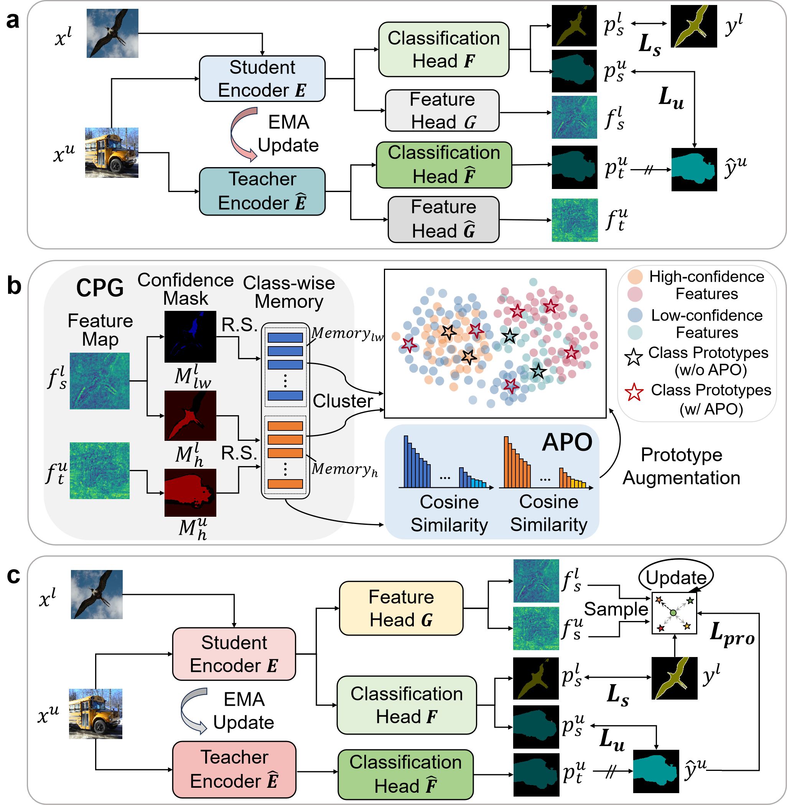

# BRPG
Official PyTorch implementation of  [Boundary-Refined Prototype Generation: A General End-to-End Paradigm for Semi-Supervised Semantic Segmentation](https://arxiv.org/abs/2307.10097), Engineering Applications of Artificial Intelligence (EAAI) 2024.

> **Abstract.** Semi-supervised semantic segmentation has attracted increasing attention in computer vision, aiming to leverage unlabeled data through latent supervision. To achieve this goal, prototype-based classification has been introduced and achieved lots of success. However, the current approaches isolate prototype generation from the main training framework, presenting a non-end-to-end workflow. Furthermore, most methods directly perform the K-Means clustering on features to generate prototypes, resulting in their proximity to category semantic centers, while overlooking the clear delineation of class boundaries. To address the above problems, we propose a novel end-to-end boundary-refined prototype generation (BRPG) method. Specifically, we perform online clustering on sampled features to incorporate the prototype generation into the whole training framework. In addition, to enhance the classification boundaries, we sample and cluster high- and low-confidence features separately based on confidence estimation, facilitating the generation of prototypes closer to the class boundaries. Moreover, an adaptive prototype optimization strategy is proposed to increase the number of prototypes for categories with scattered feature distributions, which further refines the class boundaries. Extensive experiments demonstrate the remarkable robustness and scalability of our method across diverse datasets, segmentation networks, and semi-supervised frameworks, outperforming the state-of-the-art approaches on three benchmark datasets: PASCAL VOC 2012, Cityscapes and MS COCO. 



## News

* [2023.07.25] Repo is created. Code will come soon.
* [2024.07.18] This paper has been accepted by **EAAI**!
* [2024.09.15] The code of this work has been released.

## Results

#### PASCAL VOC 2012

* ***classic setting***

| Method  | 1/16 (92) | 1/8 (183) | 1/4 (366) | 1/2 (732) | Full (1464) |
| ------- | --------- | --------- | --------- | --------- | ----------- |
| SupOnly | 45.77     | 54.92     | 65.88     | 71.69     | 72.50       |
| BRPG    | 73.62     | 76.55     | 78.00     | 79.78     | 81.91       |

* ***blended setting***

| Method  | 1/16 (662) | 1/8 (1323) | 1/4 (2646) | 1/2 (5291) |
| ------- | ---------- | ---------- | ---------- | ---------- |
| SupOnly | 67.87      | 71.55      | 75.80      | 77.13      |
| BRPG    | 79.40      | 81.61      | 81.83      | 80.78      |

#### Cityscapes

| Method  | 1/16 (186) | 1/8 (372) | 1/4 (744) | 1/2 (1488) |
| ------- | ---------- | --------- | --------- | ---------- |
| SupOnly | 65.74      | 72.53     | 74.43     | 77.83      |
| BRPG    | 76.37      | 78.56     | 79.46     | 80.26      |

#### MS COCO

| Method  | 1/128  (925) | 1/64 (1849) | 1/32 (3697) | 1/16 (7393) |
| ------- | ------------ | ----------- | ----------- | ----------- |
| SupOnly | 33.60        | 37.80       | 42.24       | 45.12       |
| BRPG    | 41.73        | 45.91       | 50.55       | 53.73       |

## Environments and Requirements

- Ubuntu 18.04.4 LTS
- CPU Intel(R) Xeon(R) CPU E5-2698 v4 @ 2.20GHz
- GPU 4x NVIDIA Tesla V100 32G
- CUDA 10.2
- python 3.7

To install requirements:

```
cd BRPG
pip install -r requirements.txt
```

**Note**: requirements.txt is the exported configuration of our environment, not all the packages listed need to be installed.

## Datasets

- Pascal: refer to [this link](https://github.com/zhixuanli/segmentation-paper-reading-notes/blob/master/others/Summary of the semantic segmentation datasets.md) and download `PASCAL VOC 2012 augmented with SBD` dataset.
- Cityscapes: [leftImg8bit](https://www.cityscapes-dataset.com/file-handling/?packageID=3) | [gtFine](https://drive.google.com/file/d/1E_27g9tuHm6baBqcA7jct_jqcGA89QPm/view?usp=sharing)
- COCO: [train2017](http://images.cocodataset.org/zips/train2017.zip) | [val2017](http://images.cocodataset.org/zips/val2017.zip) | [masks](https://drive.google.com/file/d/166xLerzEEIbU7Mt1UGut-3-VN41FMUb1/view?usp=sharing)

The structure of dictionary `data` should be as follows:

```
data
├── cityscapes
│   ├── gtFine
│   └── leftImg8bit
├── coco
│   ├── train2017
│   ├── val2017
│   └── masks
├── splits
│   ├── cityscapes
│   ├── pascal
│   └── coco
└── VOC2012
    ├── Annotations
    ├── ImageSets
    ├── JPEGImages
    ├── SegmentationClass
    ├── SegmentationClassAug
    └── SegmentationObject
```

## Pretrained Models

[ResNet-101](https://drive.google.com/file/d/1nzSX8bX3zoRREn6WnoEeAPbKYPPOa-3Y/view?usp=sharing) | [Xception-65](https://drive.google.com/open?id=1_j_mE07tiV24xXOJw4XDze0-a0NAhNVi)

```
pretrained
├── resnet101.pth
└── xception.pth
```

## Usage

#### Train

```
cd experiments/pascal/366/ours/resnet101

sh train.sh <num_gpu> <port>
```

#### Test

```
cd experiments/pascal/366/ours/resnet101

sh eval.sh
```

## Citation

If you find this project useful, please consider citing:

```
@article{dong2024boundary,
  title={Boundary-refined prototype generation: A general end-to-end paradigm for semi-supervised semantic segmentation},
  author={Dong, Junhao and Meng, Zhu and Liu, Delong and Liu, Jiaxuan and Zhao, Zhicheng and Su, Fei},
  journal={Engineering Applications of Artificial Intelligence},
  volume={137},
  pages={109021},
  year={2024},
  publisher={Elsevier}
}
```

## Acknowledgement

We thank [U2PL](https://github.com/Haochen-Wang409/U2PL), [UniMatch](https://github.com/LiheYoung/UniMatch) and other relevant works for their open-sourced projects.